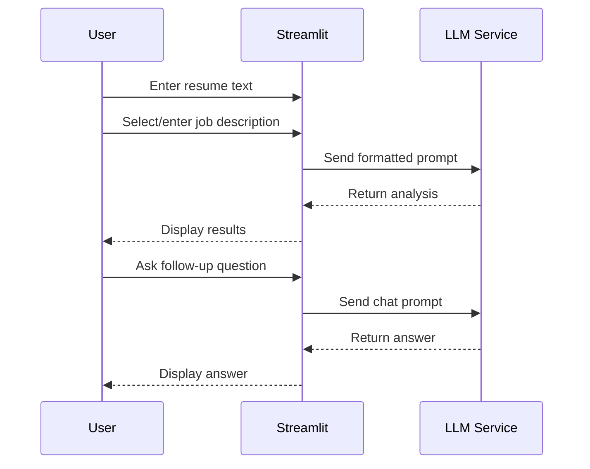

# Resume Coach

A minimal web application that uses LLM technology to analyze resumes against job descriptions, providing coaching advice for job applicants.

## Project Overview

This project aims to provide job seekers with AI-powered coaching to improve their job applications. The Resume Coach compares a user's resume against a job description and offers tailored advice, including:

- Assessment of qualification for the position
- Identification of missing skills or experience
- Highlighting of key strengths relevant to the job
- Follow-up Q&A through a chat interface

## Implementation Details

### Minimum Requirements

| ID      | Requirement              | Description                                                            | Justification                                                  |
| ------- | ------------------------ | ---------------------------------------------------------------------- | -------------------------------------------------------------- |
| **R1**  | Resume Input             | Accept text input of resume content                                    | Simplest form of input that meets the requirement              |
| **R2**  | Job Description Input    | Accept text input of job description or selection from pre-loaded list | Meets requirement while avoiding complex file parsing          |
| **R3**  | LLM Integration          | Connect to OpenAI API for GPT-4o-mini model access                     | Provides powerful LLM capabilities with simple API integration |
| **R4**  | Resume Analysis          | Generate coaching advice comparing resume to job                       | Core functionality required by project scope                   |
| **R5**  | Qualification Assessment | Determine if candidate is qualified with explanation                   | Explicitly mentioned in project example                        |
| **R6**  | Gap Identification       | Identify missing skills/requirements                                   | Explicitly mentioned in project example                        |
| **R7**  | Strength Highlighting    | Identify key matching qualifications                                   | Explicitly mentioned in project example                        |
| **R8**  | Basic Chat Interface     | Allow follow-up questions about analysis                               | Required by project scope as preferred feature                 |
| **R9**  | Web UI                   | Streamlit single-page application                                      | Specifically mentioned as acceptable framework in requirements |
| **R10** | AWS Deployment           | Deploy on EC2 instance                                                 | Required deployment environment                                |


### System Architecture

| Component       | Implementation                        | Justification                                   |
| --------------- | ------------------------------------- | ----------------------------------------------- |
| **Frontend**    | Streamlit single-page app             | Simplest implementation that meets requirements |
| **Backend**     | Python functions within Streamlit app | No need for separate backend service            |
| **LLM Service** | OpenAI API (GPT-4o-mini)              | High-quality model with simple API integration  |
| **Database**    | SQLite for job descriptions           | Simplest database with zero configuration       |
| **Deployment**  | Single EC2 instance with Docker       | Minimal cloud infrastructure                    |

### Data Flow



## Project Structure

```
resume-coach/
├── app.py                    # Main Streamlit application
├── llm.py                    # LLM integration via OpenAI
├── prompts.py                # LLM prompt templates
├── data.py                   # Database operations
├── utils.py                  # Helper functions
├── requirements.txt          # Dependencies
├── Dockerfile                # Container configuration
├── .streamlit/               # Streamlit configuration
│   └── secrets.toml          # API keys (not in repo)
└── data/                     # Data files
    └── job_descriptions.db   # SQLite database
```

## Setup Instructions

### Local Development

1. Clone the repository
```
git clone https://github.com/yourusername/resume-coach.git
cd resume-coach
```

2. Create a virtual environment and install dependencies
```
python -m venv venv
source venv/bin/activate  # On Windows: venv\Scripts\activate
pip install -r requirements.txt
```

3. Set up your OpenAI API key
```
mkdir -p .streamlit
echo "OPENAI_API_KEY = \"your-api-key-here\"" > .streamlit/secrets.toml
```

4. Run the application
```
streamlit run app.py
```

### Deployment to AWS

1. Build the Docker image
```
docker build -t resume-coach .
```

2. Deploy to EC2 (see detailed deployment instructions in the Deployment section)

## Usage Guide

1. Enter your resume text into the main text area or select from pre-loaded examples
2. Select a job description from the sidebar or enter a custom one
3. Click "Analyze Resume" to generate coaching advice
4. Review the qualification assessment, missing requirements, and key strengths
5. Use the chat interface to ask follow-up questions about the analysis

## Implementation 

See the codebase for implementation details.
